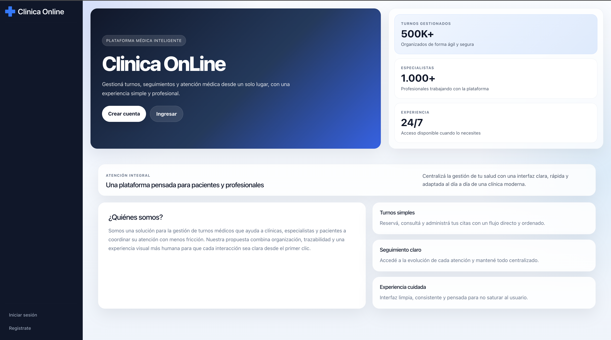
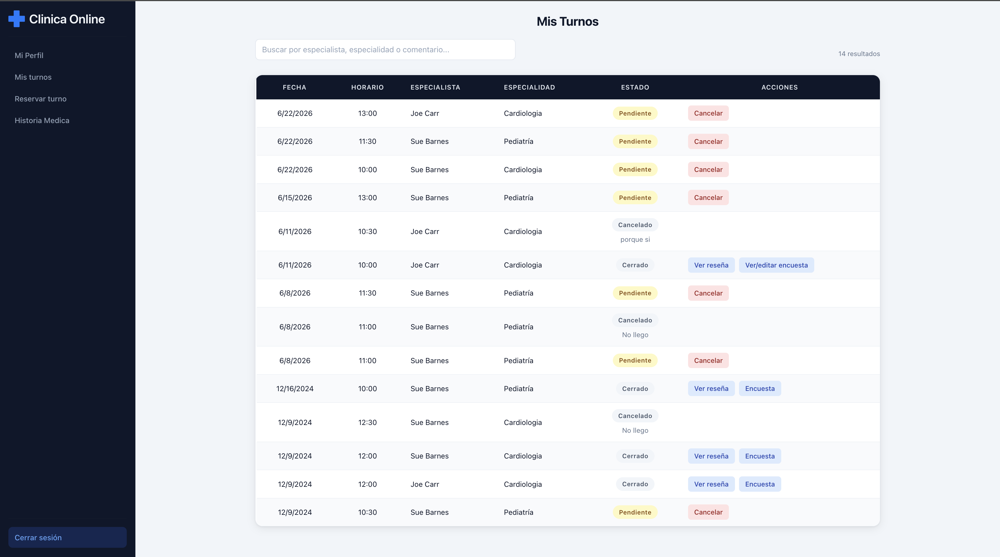
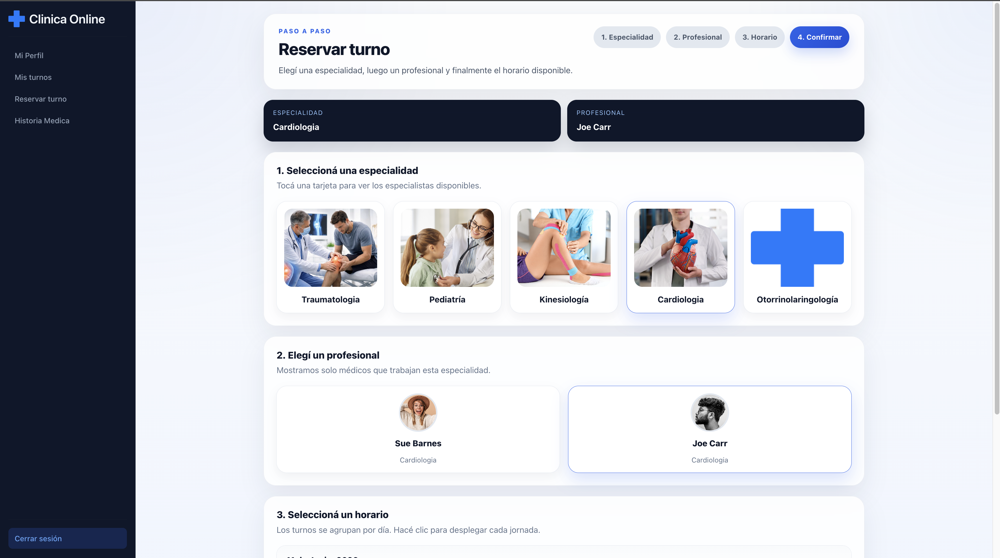
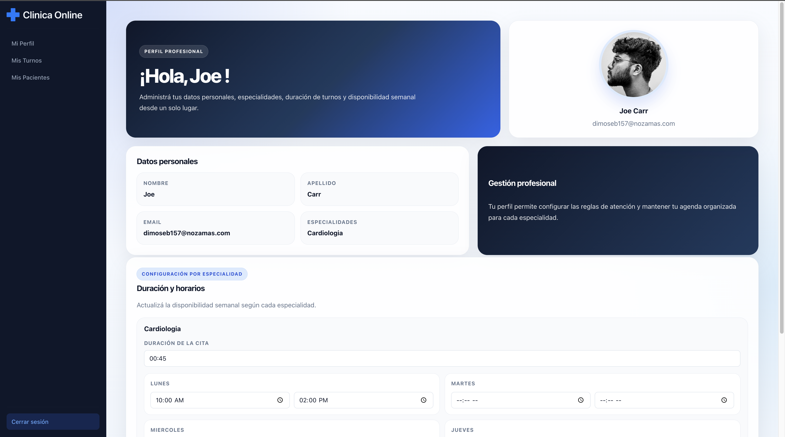
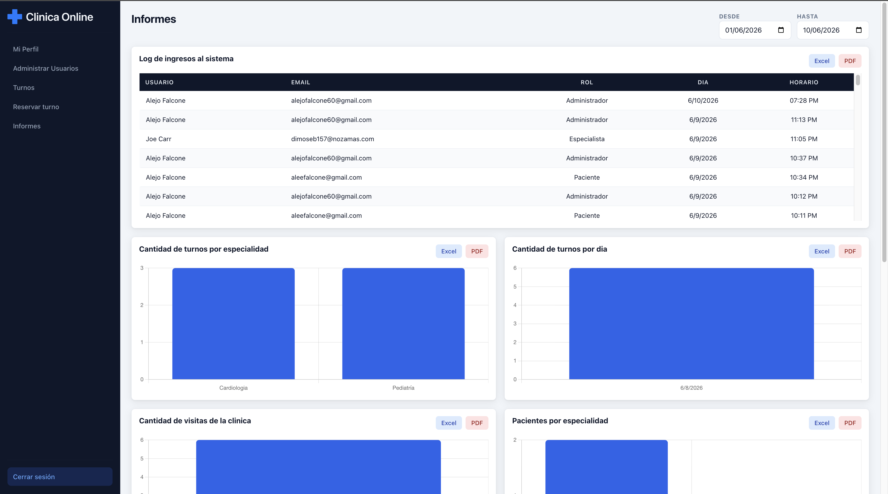

# Clinica Online - Proyecto Final LABO IV

Aplicacion web para la gestion integral de una clinica online. Permite administrar usuarios, especialistas, pacientes, turnos, historias clinicas, encuestas de atencion e informes operativos desde una interfaz moderna y responsive.

El sistema contempla tres perfiles principales: **Administrador**, **Paciente** y **Especialista**. Cada rol accede a funcionalidades especificas segun sus responsabilidades dentro de la clinica.

## Tabla de Contenidos

- [Demo visual](#demo-visual)
- [Features principales](#features-principales)
- [Tecnologias utilizadas](#tecnologias-utilizadas)
- [Directivas propias](#directivas-propias)
- [Pipes propios](#pipes-propios)
- [Roles y permisos](#roles-y-permisos)
- [Modulos de la aplicacion](#modulos-de-la-aplicacion)
- [Instalacion y ejecucion](#instalacion-y-ejecucion)
- [Scripts disponibles](#scripts-disponibles)
- [Estructura del proyecto](#estructura-del-proyecto)
- [Despliegue](#despliegue)

## Demo visual

### Home

Pantalla de bienvenida con acceso al inicio de sesion y registro.

### Mis turnos - Paciente

Seguimiento de turnos del paciente, cancelaciones, resenas y encuestas de atencion.

### Reservar turno - Paciente

Flujo paso a paso para elegir especialidad, profesional, horario y confirmar la reserva.

### Mi perfil - Especialista

Perfil profesional del especialista con datos personales, especialidades, duracion de turnos y disponibilidad semanal.

### Informes - Administrador

Panel de metricas con filtros por fecha, graficos y exportacion en PDF/Excel.

## Features principales

- Gestion de turnos medicos por especialidad, profesional, fecha y horario.
- Registro diferenciado para pacientes, especialistas y administradores.
- Autenticacion con Firebase Authentication.
- Persistencia de datos en Firebase Firestore.
- Almacenamiento de imagenes en Supabase Storage.
- Aprobacion de especialistas por parte del administrador.
- Panel administrativo para gestion de usuarios, turnos e informes.
- Historia clinica por paciente con datos fijos y dinamicos.
- Generacion y descarga de reportes en PDF.
- Exportacion de informacion a Excel.
- Encuestas y calificaciones de atencion.
- Logs de ingreso al sistema.
- Captcha configurable desde el panel de administracion.
- Interfaz responsive con Bootstrap y estilos personalizados.
- Animaciones de navegacion entre pantallas.

## Tecnologias utilizadas

| Categoria | Tecnologia |
| --- | --- |
| Framework frontend | Angular 18 |
| Lenguaje | TypeScript |
| UI y estilos | CSS, Bootstrap 5 |
| Autenticacion | Firebase Authentication |
| Base de datos | Firebase Firestore |
| Hosting | Firebase Hosting |
| Storage | Supabase Storage |
| Graficos | Chart.js |
| PDF | jsPDF, jspdf-autotable |
| Excel | xlsx |
| Alertas | SweetAlert2 |
| Captcha | ngx-captcha y captcha propio configurable |

## Directivas propias

| Directiva | Selector | Descripcion |
| --- | --- | --- |
| `AppointmentStatusColorDirective` | `[appAppointmentStatusColor]` | Aplica estilos tipo badge segun el estado numerico del turno: pendiente, aceptado, rechazado, finalizado o cancelado. |
| `OwnCaptchaDirective` | `[appOwnCaptcha]` | Renderiza un captcha propio, permite refrescar la imagen, valida la respuesta ingresada y emite el resultado al formulario. |
| `PatientBehaviorColorDirective` | `[appPatientBehaviorColor]` | Cambia el color del indicador de comportamiento del paciente segun el valor recibido. |
| `ZoomInImagesDirective` | `[appZoomInImages]` | Agrega un efecto de zoom suave al pasar el mouse sobre imagenes. |

## Pipes propios

| Pipe | Nombre de uso | Descripcion |
| --- | --- | --- |
| `FormatAppointmentStatusPipe` | `formatAppointmentStatus` | Convierte el estado numerico de un turno en texto legible, por ejemplo `Pendiente`, `Aceptado`, `Finalizado` o `Cancelado`. |
| `FormatDatePipe` | `formatDate` | Formatea fechas en un texto amigable con dia y mes en espanol. |
| `FormatHourPipe` | `formatHour` | Formatea una fecha u hora al formato `HH:mm`. |
| `SpecialtyNamePipe` | `specialtyName` | Extrae el nombre de una especialidad desde el objeto recibido. |

## Roles y permisos

### Administrador

- Dar de alta pacientes, especialistas y administradores.
- Aprobar o rechazar especialistas.
- Consultar todos los usuarios registrados.
- Solicitar turnos para pacientes.
- Cancelar turnos con comentario.
- Acceder a informes y estadisticas de la clinica.
- Exportar informacion en PDF y Excel.
- Activar o desactivar el captcha de registro.

### Paciente

- Registrarse con datos personales, obra social e imagenes de perfil.
- Iniciar sesion una vez verificado el email.
- Solicitar turnos por especialidad y especialista.
- Consultar sus turnos.
- Cancelar turnos pendientes.
- Ver resenas del especialista.
- Calificar la atencion recibida.
- Completar o editar encuestas de satisfaccion.
- Consultar y descargar su historia clinica.

### Especialista

- Registrarse indicando una o mas especialidades.
- Esperar aprobacion administrativa para operar.
- Configurar disponibilidad horaria.
- Consultar sus turnos asignados.
- Aceptar, rechazar o cancelar turnos.
- Finalizar atenciones.
- Cargar resenas y datos de historia clinica.
- Consultar pacientes atendidos.

## Modulos de la aplicacion

- **Home:** presentacion de la plataforma y accesos principales.
- **Login:** autenticacion, accesos rapidos, validacion de rol y registro de ingresos.
- **Registro:** alta de pacientes, especialistas y administradores.
- **Panel paciente:** turnos, reserva de citas, perfil e historia clinica.
- **Panel especialista:** turnos, pacientes atendidos y perfil profesional.
- **Panel administrador:** usuarios, turnos, registros, captcha e informes.
- **Informes:** graficos de actividad, turnos por especialidad, turnos por dia, visitas y exportaciones.

